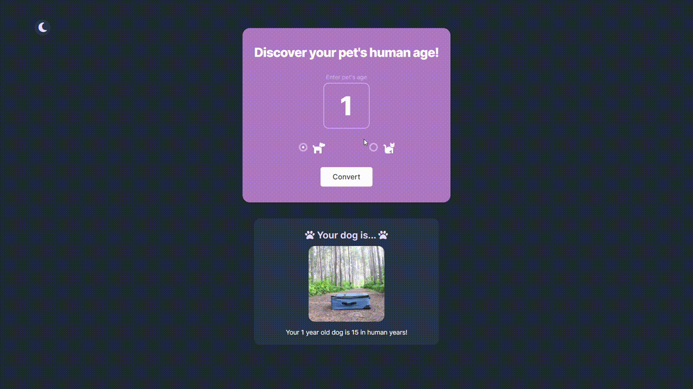

# Pet Age Converter

This app provides a simple and easy way to convert your pet's age into human years. It supports both cats and dogs.

## Features

- Converts pet's age to human age equivalent
- Supports both cats and dogs
- Provides clear and easy-to-read results
- Has a dark mode toggle button for user's convenience

## Technologies Used

This application is built using the following technologies:

- HTML
- CSS
- JavaScript

## What I Learned

This project reinforced my knowledge of JavaScript, and provided opportunity to apply HTML and CSS skills. I had the chance to:

- Use HTML to structure the web page
- Use CSS to style the web page and create a responsive design
- Use JavaScript to handle user input, perform calculations, and update the DOM
- Use local storage to store and retrieve data
- Implement a dark mode toggle button using JavaScript

## Live demo

View the app [live preview](https://quiet-clafoutis-975c0a.netlify.app/)
